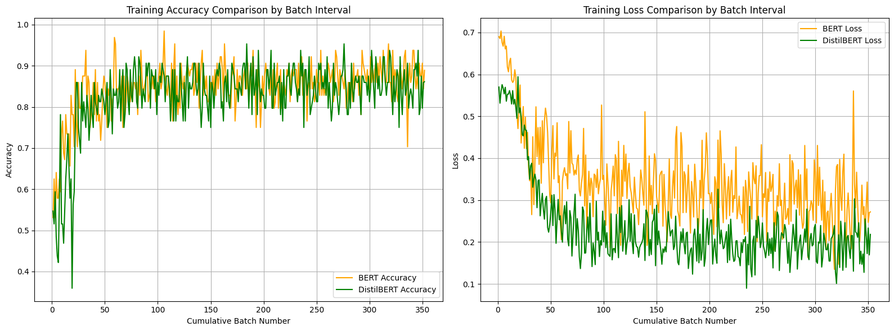
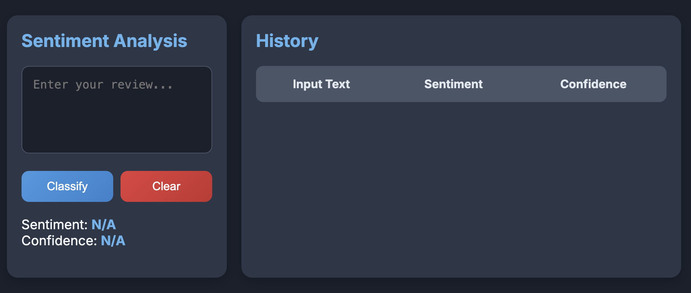
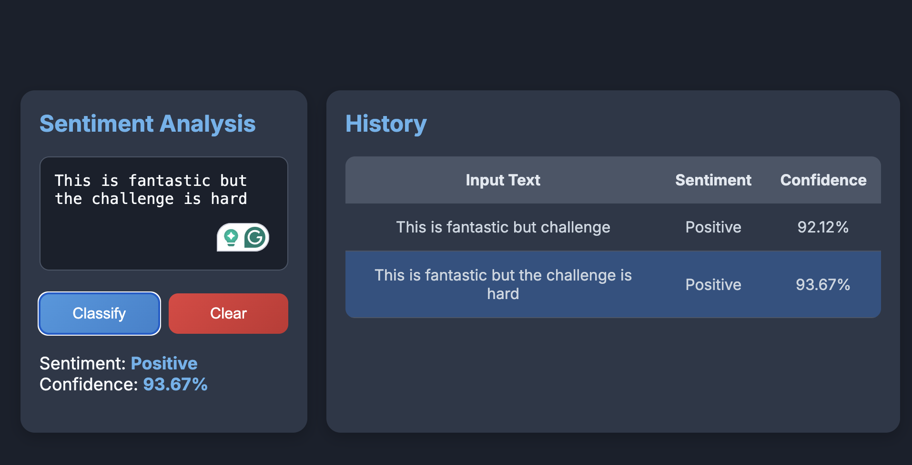

<h1 align="center">ECE590 Final Project</h1>

<h4 align="center">Group BERT</h4>

# 1. Introduction

## 1.1 Project Goals

This project initially selected BERT as the pre-trained model and fine-tuned it to perform a text classification task. Inspired by recent advancements in open-source large language models (LLMs), the project aimed to enhance accessibility for a broader audience, including non-professionals, by implementing real-time deployment of the fine-tuned model. Additionally, to improve inference speed and reduce resource consumption, the project incorporated model distillation to optimize deployment efficiency.

The three key objectives of this project can be summarized as follows:

Fine-tune the BERT model for text classification tasks.

Optimize the fine-tuned model through distillation techniques.

Enable real-time deployment for practical usability.

## 1.2 **Project Challenges**

Optimizing Model Fine-Tuning

Despite its strong performance across NLP tasks, BERT's extensive parameter count poses challenges in resource-constrained environments. Previous setbacks during fine-tuning for fine-grained sentiment analysis on the SST-5 dataset underscored the critical need for precise hyperparameter selection and optimizer configuration to ensure training success.


Streamlining Model Distillation

To improve efficiency and reduce resource usage for real-time applications, knowledge distillation was employed. This process transfers insights from a complex model to a simpler one. The challenge lies in devising effective distillation strategies and targets to ensure the streamlined model closely replicates the original's performance.


Achieving Real-Time Deployment

Real-time deployment demands that the model delivers high performance in dynamic, practical environments. This requires optimizing aspects such as model loading time, inference speed, and concurrent processing capabilities to achieve responsive and efficient real-world performance.

# 2. Model and Dataset Delection

In tasks that do not require text generation, BERT has proven to excel in understanding contextual information thanks to its bidirectional training architecture, making it an ideal choice as a pre-training model. For this project’s text classification task, we selected the 'BertForSequenceClassification' model.

To evaluate the model's effectiveness, we utilized the Large Movie Review Dataset, a benchmark dataset for binary sentiment classification. This dataset contains 25,000 highly polarized movie reviews for training and an additional 25,000 reviews for testing. Moreover, it provides a substantial amount of unlabeled data, offering opportunities for further exploration and enhancement of model performance.

# 3. Methodology

## 3.1 Dataset Preprocess
At the starting point, the dataset needs to be preprocessed. In the custom-defined class MovieReviewDataset, we first loaded the dataset and tokenizer, then tokenized all the text, and finally returned the input required by the model in a dictionary format, including 'input\_ids', 'attention\_mask', and 'labels'.

An important parameter during tokenization is "max\_length," which specifies the maximum sequence length. This parameter is critical when working with BERT or other Transformer-based models for text processing, as it determines the maximum number of tokens the model can handle in a single input. The choice of maximum sequence length directly affects training and inference efficiency, resource usage, and model performance. Longer sequences require more computation and memory, while unnecessarily long padding for short sequences can reduce training efficiency.

In this project, the Large Movie Review Dataset consists of highly polarized movie reviews, each with a length suitable for concise sentiment analysis. Analysis revealed that most reviews can effectively convey their sentiment within 128 tokens. Therefore, the maximum sequence length was set to 128 to balance resource efficiency and model performance.

Next, I split the original training set of 25,000 reviews into a new training set and validation set by a specified proportion. To streamline the training process, I defined a data\_loader for each dataset to handle data shuffling and batch processing efficiently.

The MovieReviewDataset class, as shown in the code, manages dataset loading, tokenization, and preparation of inputs. It uses the Hugging Face load\_dataset function to load the Large Movie Review Dataset and a BERT tokenizer for text tokenization. The class handles padding, truncation, and conversion of text into the required input format (input\_ids, attention\_mask, and labels). This design ensures compatibility with BERT and allows for flexible integration with data\_loader utilities to facilitate training and evaluation.

```python
class AGNewsDataset(Dataset):
    def __init__(self, split):
        self.dataset = load_dataset('ag_news', split=split)
        self.tokenizer = BertTokenizer.from_pretrained('bert-base-uncased')
        self.max_length = 128

    def __len__(self):
        return len(self.dataset)

    def __getitem__(self, idx):
        text, label = self.dataset[idx]['text'], self.dataset[idx]['label']
        inputs = self.tokenizer(
            text,
            padding='max_length',
            truncation=True,
            max_length=self.max_length,
            return_tensors="pt"
        )
        input_ids = inputs['input_ids'].squeeze(0)
        attention_mask = inputs['attention_mask'].squeeze(0)

        return {
            'input_ids': input_ids,
            'attention_mask': attention_mask,
            'labels': torch.tensor(label)
        }


## 3.2 Selection of Hyperparameters

1. Batch Size = 64:

Batch size plays a critical role in model performance, training time, and generalization ability. Smaller batch sizes can enhance generalization by introducing noise that helps prevent overfitting and accelerates gradient descent, leading to faster convergence. However, overly small batches may result in unstable training and prolonged convergence times. Additionally, batch size is constrained by hardware resources, particularly GPU memory. Larger batch sizes can better utilize GPU parallel processing capabilities but also demand more memory.

Considering these factors, I selected the largest batch size that fits within the GPU memory. With a training set of 25,000 labeled samples, a batch size of 64 strikes a balance, being neither too large nor too small.

2. Learning Rate = 2e-5:

The learning rate is a crucial hyperparameter that determines the adjustment magnitude of model weights, directly influencing the speed and quality of training. A learning rate that is too high may cause the model to overshoot or oscillate near the optimal solution, making convergence difficult. Conversely, a learning rate that is too low can result in slow training and failure to reach the optimal solution.

After reviewing the learning rates used for training pre-trained models on text classification tasks in Hugging Face, I determined that 2e-5 would be an optimal choice for this project, balancing stability and efficiency.

3. Learning Rate Decay Strategy = ExponentialLR(optimizer, gamma=0.96):

Implementing a learning rate decay strategy is essential to facilitate smoother convergence and improved performance. For this project, I adopted the ExponentialLR decay strategy for its continuous and gradual reduction of the learning rate. Unlike abrupt adjustments at fixed steps, exponential decay ensures smooth transitions during training, avoiding sudden disruptions and promoting stable convergence.

The decay factor gamma=0.96 was chosen because the training process is expected to be lengthy. A value close to 1 ensures the learning rate does not decrease too quickly, maintaining sufficient flexibility for parameter adjustments throughout training.

4. Epochs = 1:

The number of training epochs is determined based on achieving convergence while considering dataset size and batch size. Given the Large Movie Review Dataset's size (25,000 labeled training samples) and the relatively small batch size of 64, a single epoch is sufficient to ensure convergence for this binary sentiment classification task. This approach minimizes overfitting while achieving effective training within resource constraints.

## 3.3 Train and Evaluate

### 3.3.1 Training Process

To begin training, we first configure the computing device, prioritizing a CUDA-enabled GPU for enhanced efficiency. The BERT model is then transferred to the selected device. Before the training loop starts, we prepare a dictionary to record key training metrics, such as batch-wise loss and accuracy, for detailed tracking and analysis.

During the training process, the model iterates over all data batches from the train\_loader for each epoch. For every batch, the input IDs, attention masks, and labels are moved to the computing device. Forward propagation is then performed to compute the model's predictions and calculate the loss. While this process resembles traditional sentiment analysis training, the main difference lies in our use of a multi-label cross-entropy loss function tailored to this task.

Next, we execute backward propagation and update the model weights through the optimizer. To keep track of progress and detect potential issues, we output the accuracy and loss after processing each batch. Additionally, batch metrics are stored in a dictionary for later export to a CSV file, enabling thorough post-training analysis.

Given the dataset's substantial size, it is feasible for the model to converge within a single epoch. To support effective optimization throughout training, we integrate a learning rate scheduler that adjusts the learning rate every 10 batches, ensuring smooth progress.

The code is as follow:

```python
for epoch in range(epochs):
total_loss = 0
total_accuracy = 0
for batch_idx, batch in enumerate(tqdm(train_loader, desc=f"Training Epoch {epoch+1}/{epochs}")):
    input_ids = batch['input_ids'].to(device)
    attention_mask = batch['attention_mask'].to(device)
    labels = batch['labels'].to(device)

    optimizer.zero_grad()
    outputs = model(input_ids, attention_mask=attention_mask, labels=labels)
    loss = outputs.loss
    loss.backward()
    optimizer.step()

    # Convert the logits to probabilities and then to the predicted classes
    probabilities = torch.nn.functional.softmax(outputs.logits, dim=-1)
    predictions = torch.argmax(probabilities, dim=1)
    accuracy = (predictions == labels).float().mean()

    total_loss += loss.item()
    total_accuracy += accuracy.item()

    # Record metrics for this batch
    metrics['epoch'].append(epoch)
    metrics['batch'].append(batch_idx)
    metrics['train_loss'].append(loss.item())
    metrics['train_accuracy'].append(accuracy.item())
    metrics['learning_rate'].append(scheduler.get_last_lr()[0])

    # Print the loss and accuracy every 10 batches
    if (batch_idx + 1) % 10 == 0:
        print(f"Batch {batch_idx+1} - Loss: {loss.item():.4f}, Accuracy: {accuracy.item():.4f}")

        # Update the learning rate
        scheduler.step()

# Calculate the average loss and accuracy for this epoch
avg_loss = total_loss / len(train_loader)
avg_accuracy = total_accuracy / len(train_loader)
print(f"Epoch {epoch+1} - Average Loss: {avg_loss:.4f}, Average Accuracy: {avg_accuracy:.4f}")

torch.save(model.state_dict(), f'classification_model_e{epoch+1}.pth')
```

### 3.3.2 Validation Process

During the validation process, gradient computations are unnecessary, so we use torch.no\_grad() to prevent gradients from being calculated or stored. This reduces memory consumption and enhances computational efficiency. Similar to the training phase, during validation, we calculate the loss using the logits and apply the argmax function to identify the index of the highest value.

The validation code is as follow:

```python
def validate(model, valid_loader, device):
    model.eval()
    total_accuracy = 0
    total_loss = 0
    total_batches = len(valid_loader)

    with torch.no_grad():
        for batch in tqdm(valid_loader):
            input_ids = batch['input_ids'].to(device)
            attention_mask = batch['attention_mask'].to(device)
            labels = batch['labels'].to(device)

            outputs = model(input_ids, attention_mask=attention_mask, labels=labels)
            loss = outputs.loss

            predictions = torch.argmax(outputs.logits, dim=1)
            accuracy = (predictions == labels).float().mean()

            total_accuracy += accuracy.item()
            total_loss += loss.item()

    average_accuracy = total_accuracy / total_batches
    average_loss = total_loss / total_batches
    print(f"Validation Loss: {average_loss:.4f}, Accuracy: {average_accuracy:.4f}")

    return average_loss, average_accuracy
```

## 3.4 Model Distillation

Model distillation is a model compression technique whose core idea is to train a smaller "student" model to imitate the behavior of a larger, better-performing "teacher" model. In this process, the student model not only learns the standard data labels, but also learns the prediction results of the teacher model on the input data, which usually includes the probability distribution of the teacher model output (i.e., the logits). This method makes the student model smaller and has lower computing requirements while retaining the knowledge and performance of the teacher model. It is suitable for application scenarios that require fast response and low resource consumption, such as deployment in mobile devices and real-time systems.

### 3.4.1 Selection of Distillation Model and Hyperparameters

For training the DistilBERT model, we opted to reuse the hyperparameters that previously demonstrated effectiveness with the original BERT model. This decision was motivated by two key factors:

Stability and Predictability: Maintaining consistent hyperparameter settings, such as learning rate and batch size, helps stabilize the training process and ensures predictability. Since these parameters yielded successful results in prior training with a similar model structure and dataset, reusing them minimizes uncertainties and reduces the trial-and-error costs typically associated with hyperparameter tuning at the start of training.

Efficiency and Resource Optimization: Hyperparameter optimization can be computationally intensive and time-consuming, particularly in resource-constrained scenarios like this project. Leveraging known, effective hyperparameter configurations significantly conserves resources and shortens the development cycle. This approach not only facilitates rapid deployment but also ensures the efficient utilization of limited computational resources.

The distillation model chosen for this project is DistilBertForSequenceClassification, which offers several advantages:

Streamlined Design: DistilBERT is a compact version of the original BERT model, designed to retain much of its functionality while significantly reducing the number of parameters and computational overhead. This makes it an excellent choice for environments where computational resources are limited but high performance is still required.

Integrated Knowledge Distillation: DistilBERT integrates knowledge distillation into its training process, learning from both hard labels and soft labels generated by a teacher model. This dual learning approach enhances its generalization capabilities, enabling it to efficiently handle a wide range of sequence classification tasks.

Hyperparameters Used: Batch Size: 64

Chosen to balance memory constraints and training efficiency.

Learning Rate: 2e-5

Selected based on prior results for pre-trained models in text classification tasks.

Learning Rate Decay Strategy: ExponentialLR(optimizer, gamma=0.96)

Ensures gradual and smooth learning rate reduction, avoiding sudden changes and maintaining stable convergence.

Epochs: 1

Given the dataset size and batch configuration, one epoch was sufficient to achieve convergence without overfitting.

### 3.4.2 Train and Evaluate

In the training and evaluation of the distillation model, the focus lies on the distinctions compared to the original model's training and evaluation. These differences are primarily seen in the training objectives, loss functions, and the interaction between the teacher and student models.

Training with Teacher and Student Models: During distillation, both a pre-trained teacher model and a student model are used concurrently. The teacher model operates in evaluation mode (model.eval()), meaning its weights remain fixed. It provides outputs and probability distributions (soft labels) as guidance for training the student model. These soft labels offer richer information than hard labels alone, enabling the student model to capture nuanced patterns and maintain high performance despite its simpler structure.

Distillation Loss Function: The loss function in model distillation differs significantly from that used in traditional training. Standard training typically relies on cross-entropy loss, which measures the discrepancy between predictions and true labels.

In contrast, distillation introduces an additional term to the loss function: the difference between the teacher model's outputs and the student model's outputs. This difference is often computed using metrics like Kullback-Leibler (KL) divergence on softened probability distributions. By including this term, the student model learns not only to predict labels accurately but also to mimic the teacher model's data-processing behavior. This approach allows the student model to maintain high performance while reducing complexity and computational demands.

Model Interaction During Training: The interaction between the student and teacher models is another key distinction. The student model adjusts its parameters to align not only with the true labels but also with the teacher model's output behavior. This dual objective makes the distillation process more intricate and demanding compared to standard model training.

Evaluation of the Distilled Model: The evaluation process for the distilled model mirrors that of the original model, with no significant differences in approach. Detailed explanations of the evaluation process are therefore omitted here. For reference, the complete implementation code can be found in the appendix.

This process ensures that the student model effectively leverages the knowledge of the teacher model, achieving a balance between reduced computational complexity and robust performance.

## 3.5 Model Real-time Deployment

### 3.5.1 The Significance of Model Deployment

As technology advances, LLMs have increasingly become integral to our daily lives and work and these models have greatly enhanced our efficiency in processing information and executing tasks. Consequently, mastering the deployment of these large models has become an essential skill. Future work environments will increasingly rely on the effective application of these advanced technologies to drive productivity improvements and innovation. Learning how to deploy and optimize these models not only helps us make better use of existing technologies but is also key to adapting to future trends in technological development.

### 3.5.2 Real Time Model Deployment

First, we developed a web application using FastAPI and configured Cross-Origin Resource Sharing (CORS) middleware to enable requests from any origin, which is essential for seamless interaction between the front-end application and the back-end service. A Pydantic-based model, TextIn, was defined to handle incoming text data in the requests. On the backend, we loaded a pre-trained DistilBERT classification model and its corresponding tokenizer. This model, previously trained and saved, was loaded onto the CPU for inference. We then set up a route, \\predict, to receive text input, tokenize it using the DistilBERT tokenizer, and pass it to the model for prediction. Finally, the route returns the classification results along with the probabilities for each class.

Additionally, we created a webpage file named web.html to serve as an intuitive and user-friendly front-end interface. The interface provides a simple and clear design, allowing users to input text and submit it to the backend service with a single click. A designated result display area ensures that users can instantly view the classification results and the associated probabilities generated by the model. The design emphasizes user convenience and visual appeal, aiming to deliver a comfortable and satisfying experience.

The detailed deployment code used in this section is included in the appendix for reference.

# 4. Result Analysis

## 4.1 Comparison Between Original Model and Distilled Model

### 4.1.1 Loss and Accuracy

First of all, what we ought to compare is naturally loss and accuracy. We need to measure whether the performance of the distilled model is almost the same as that of the original model. Otherwise, we cannot deploy the distilled model in real time.

The figure below shows the training process of the two models. We can clearly see that both models have converged. This proves that our parameter selection is appropriate for our chosen task and model. In addition, the accuracy of both models can exceed 90%, which proves that the training effect is pretty good.



|   Model    | Average Accuracy on Train Dataset | Accuracy on Valid Dataset | Accuracy on Test Dataset | Average Loss on Train Dataset |
| :--------: | :-------------------------------: | :-----------------------: | :----------------------: | :---------------------------: |
|    BERT    |              0.9231               |          0.9416           |          0.9374          |            0.2274             |
| DistilBERT |              0.9133               |          0.9215           |          0.9225          |            0.1851             |

According to the information in the above figure and table, we can also see that the performance difference between the original model and the distilled model on the test set is very small, so there is no problem in using the distilled model for real-time deployment.

### 4.1.2 Attention Weights

Understanding the decision-making process of large models is a complex but crucial task, especially in scenarios where the model’s decisions directly affect practical applications. To deeply explore how these models process and interpret data, this project takes an intuitive approach: by visualizing the attention weight of a given text in a specified BERT model. This method can significantly reveal the words that the model focuses on during the prediction process, thereby helping us understand the basis for the model's judgment.

In addition, by comparing the attention distribution of the original BERT model and the distilled model when processing the same text, we can more clearly see the subtle differences between the two in understanding and processing information. This not only helps to verify whether the distillation process successfully retains key information, but also helps us evaluate whether the simplified model improves its interpretability and reliability while maintaining performance. Through this comparison, we are able to more comprehensively evaluate the effectiveness of the model distillation technique and provide an empirical basis for future model optimization and application.

The following two pictures are the visualization of attention weights of BERT and distilBERT for the same text "Costco faces sex discrimination suit An assistant manager at one of Costco #39;s Colorado warehouses filed a sex discrimination lawsuit against the Issaquah-based company yesterday, alleging that it overlooks women for promotion.".


From the above figures, we can observe that punctuation marks occupy a prominent position in the attention weights of both models, which may indicate that in text classification tasks, the models tend to utilize punctuation marks in sentence structures as key points for information integration. In any natural languages, punctuation marks often mark the end of a sentence or phrase and carry important contextual information. Thus, tokens with large attention weights relative to punctuation marks often mean that they have a greater influence on the model's decision-making.

After analyzing the attention weights, we noticed that words like "costco", "suit", "lawsuit", "warehouse" and "company" received higher weights, which are related to the final judgment of the model. keywords, their significant weights are consistent with our intuitive understanding of text content.

We can also see the significant difference between BERT and distilBERT from the two pictures. Different from BERT, which pays extra attention to the information carried by the last two punctuation marks, distilBERT only pays attention to the information carried by the last punctuation mark. This may be the information that distilBERT discards due to model size limitations.

### 4.1.3 Deployment Results Display

We could start the Uvicorn server and run the FastAPI application instance in the "app.py" file. by simply running the following code in the project environment.

```bash
uvicorn app:app --reload --host 0.0.0.0 --port 8000
```

Then, we could open the "web.html" file I wrote before, and we can see the text classification UI interface we designed in the browser.



In the deployment results of this project, users first enter text through a simple and user-friendly interface. This interface includes a text box where users can type any text they wish to classify. After entering the text, users click the "Classify" button, and the system immediately processes and displays the classification results.

The result display area on the interface is very intuitive. It not only shows the category into which the text has been classified but also displays the corresponding confidence probability, allowing users to clearly see the model's confidence level in its classification judgment. For example, in the typical use case in the following figure, a user entered a description of a sports statement "Kobe Bryant had won the FMVP in the 2009-1010 NBA Final.", and the system would accurately identify it as belonging to the "Sports" category and might show a high confidence probability of 0.99, indicating that the model is very sure of its correctness.



The entire user interface is designed to ensure concision and satisfaction during use. This design allows even users without domain knowledge about LLM to easily perform text classification, allowing users to easily use the trained model for their own use. This mode of interaction not only lowers the barrier to use for users but also makes the application of technology more widespread and practical.

# 5. Conclusions

This project successfully implemented the text classification task on the AG News data set by fine-tuning the BERT pre-trained model. The focus of the project is to optimize and experimentally compare the original BERT model and the DistilBERT model distilled based on this model. Both models performed very well on unseen data sets, with classification accuracy exceeding 90%, demonstrating the strong adaptability and effectiveness of the pre-trained models on downstream tasks.

In addition, this project not only focuses on model training and testing, but also explores the implementation of model deployment and real-time user interaction. By creating a back-end service based on FastAPI and matching it with a simple front-end user interface, this project successfully achieved real-time deployment and inference of the model, allowing users to submit text directly through the web interface and obtain instant classification results. This real-time interaction capability greatly improves the practicality and user experience of the model. Through the implementation of this project, I was able to deeply understand the entire process of a model from implementation to distillation to deployment and optimization.

In future work directions, the project plans to explore more hyperparameter combinations to further optimize model performance. Taking into account the availability of computing resources, this will help improve the accuracy and responsiveness of the model.

At the same time, the project will also evaluate the performance of different pre-trained models and select the optimal model as a teacher model for distillation, in order to obtain a more efficient student model. In addition, the project also plans to optimize the user interface and add more features, such as visualizing the attention weight of text, which will not only enhance the user's interactive experience, but also help users better understand how the model interprets and classifies text.

The implementation of these plans and improvements is expected to make the text classification system more powerful and better able to meet users' needs for automatic text classification in different scenarios. Through continuous technical iteration and integration of user feedback, the project was able to develop a text classification tool that is both efficient and easy to use.

# 6. Appendix

#### This section contains some important code during the implementation of this project. The complete code of the project is uploaded in the form of a compressed package.

- Complete code to train the BERT model

```python
def train(model, train_loader, valid_loader, optimizer, epochs=1, file_name='training_metrics.csv'):
device = torch.device("cuda:9" if torch.cuda.is_available() else "cpu")
model.to(device)
model.train()

metrics = {
    'epoch': [],
    'batch': [],
    'train_loss': [],
    'train_accuracy': [],
    'learning_rate': [],
    'validation_loss': [],
    'validation_accuracy': []
}

for epoch in range(epochs):
    total_loss = 0
    total_accuracy = 0
    for batch_idx, batch in enumerate(tqdm(train_loader, desc=f"Training Epoch {epoch+1}/{epochs}")):
        input_ids = batch['input_ids'].to(device)
        attention_mask = batch['attention_mask'].to(device)
        labels = batch['labels'].to(device)

        optimizer.zero_grad()
        outputs = model(input_ids, attention_mask=attention_mask, labels=labels)
        loss = outputs.loss
        loss.backward()
        optimizer.step()

        # Convert the logits to probabilities and then to the predicted classes
        probabilities = torch.nn.functional.softmax(outputs.logits, dim=-1)
        predictions = torch.argmax(probabilities, dim=1)
        accuracy = (predictions == labels).float().mean()

        total_loss += loss.item()
        total_accuracy += accuracy.item()

        # Record metrics for this batch
        metrics['epoch'].append(epoch)
        metrics['batch'].append(batch_idx)
        metrics['train_loss'].append(loss.item())
        metrics['train_accuracy'].append(accuracy.item())
        metrics['learning_rate'].append(scheduler.get_last_lr()[0])

        # Print the loss and accuracy every 10 batches
        if (batch_idx + 1) % 10 == 0:
            print(f"Batch {batch_idx+1} - Loss: {loss.item():.4f}, Accuracy: {accuracy.item():.4f}")

            # Update the learning rate
            scheduler.step()

    # Calculate the average loss and accuracy for this epoch
    avg_loss = total_loss / len(train_loader)
    avg_accuracy = total_accuracy / len(train_loader)
    print(f"Epoch {epoch+1} - Average Loss: {avg_loss:.4f}, Average Accuracy: {avg_accuracy:.4f}")

    # Perform validation at the end of the epoch and record metrics
    val_loss, val_accuracy = validate(model, valid_loader, device)
    metrics['validation_loss'].append(val_loss)
    metrics['validation_accuracy'].append(val_accuracy)

    torch.save(model.state_dict(), f'classification_model_e{epoch+1}.pth')

# Save metrics to a CSV file
with open(file_name, mode='w', newline='') as file:
    writer = csv.writer(file)
    writer.writerow(['epoch', 'batch', 'train_loss', 'train_accuracy', 'learning_rate'])
    for i in range(len(metrics['epoch'])):
        writer.writerow([metrics['epoch'][i],
                         metrics['batch'][i],
                         metrics['train_loss'][i],
                         metrics['train_accuracy'][i],
                         metrics['learning_rate'][i]])
```

- Code to train the distillation model

```python
def train_distillation(teacher_model, student_model, train_loader, valid_loader, optimizer, device, epochs=1, file_name='distilbert_training_metrics.csv'):
    teacher_model.eval()
    student_model.train()
    
    metrics = {
        'epoch': [],
        'batch': [],
        'train_loss': [],
        'train_accuracy': [],
        'learning_rate': [],
    }

    for epoch in range(epochs):
        total_loss = 0
        total_accuracy = 0
        for batch_idx, batch in enumerate(tqdm(train_loader, desc=f"Training Epoch {epoch+1}/{epochs}")):
            student_model.train()
            inputs = {k: v.to(device) for k, v in batch.items() if k != 'labels'}
            labels = batch['labels'].to(device)

            with torch.no_grad():
                teacher_outputs = teacher_model(**inputs).logits
                teacher_probs = softmax(teacher_outputs, dim=-1)

            student_outputs = student_model(**inputs).logits
            student_probs = log_softmax(student_outputs, dim=-1)

            loss_kl = kl_div(student_probs, teacher_probs, reduction='batchmean')
            loss_ce = cross_entropy(student_outputs, labels)
            loss = 0.5 * loss_kl + 0.5 * loss_ce

            optimizer.zero_grad()
            loss.backward()
            optimizer.step()

            _, predicted = torch.max(student_outputs, 1)
            batch_correct = (predicted == labels).sum().item()
            batch_accuracy = batch_correct / labels.size(0)

            total_loss += loss.item()
            total_accuracy += batch_accuracy

            # Record metrics for this batch
            metrics['epoch'].append(epoch)
            metrics['batch'].append(batch_idx)
            metrics['train_loss'].append(loss.item())
            metrics['train_accuracy'].append(batch_accuracy)
            metrics['learning_rate'].append(optimizer.param_groups[0]['lr'])

            if (batch_idx+1) % 10 == 0:
                print(f"Batch {batch_idx+1} - Loss: {loss.item():.4f}, Accuracy: {batch_accuracy:.4f}")
                scheduler.step()

        # Calculate the average loss and accuracy for this epoch
        avg_loss = total_loss / len(train_loader)
        avg_accuracy = total_accuracy / len(train_loader)
        print(f"Epoch {epoch+1} - Average Loss: {avg_loss:.4f}, Average Accuracy: {avg_accuracy:.4f}")

        # Perform validation at the end of the epoch and record metrics
        valid_accuracy = evaluate(student_model, valid_loader, device)
        print(f"Epoch {epoch+1} - Validation Accuracy: {valid_accuracy:.4f}")

    # Save metrics to a CSV file
    with open(file_name, mode='w', newline='') as file:
        writer = csv.writer(file)
        writer.writerow(['epoch', 'batch', 'train_loss', 'train_accuracy', 'learning_rate'])
        for i in range(len(metrics['epoch'])):
            writer.writerow([metrics['epoch'][i], metrics['batch'][i], metrics['train_loss'][i], metrics['train_accuracy'][i],
                             metrics['learning_rate'][i]])
    
    torch.save(student_model.state_dict(), 'classification_distilled_model_e1.pth')
```

- Code to evaluate the distillation model

```python
def evaluate(model, data_loader, device):
    model.eval()
    total_correct = 0
    total_examples = 0

    with torch.no_grad():
        for batch in tqdm(data_loader, desc="Evaluating", leave=False):
            inputs = {k: v.to(device) for k, v in batch.items() if k != 'labels'}
            labels = batch['labels'].to(device)

            outputs = model(**inputs).logits
            _, predicted = torch.max(outputs, 1)
            total_correct += (predicted == labels).sum().item()
            total_examples += labels.size(0)

    accuracy = total_correct / total_examples
    return accuracy
```

- Code to visualize attention weights for BERT model

```python
def visualize_attention(text, model, tokenizer):
    model.eval()

    inputs = tokenizer(text, return_tensors="pt", add_special_tokens=True)
    inputs = {k: v.to(model.device) for k, v in inputs.items()}
    
    with torch.no_grad():
        outputs = model(**inputs, output_attentions=True)

    attention = outputs.attentions[-1].mean(dim=1)
    attention_weights = attention[0].detach().numpy()

    tokens = tokenizer.convert_ids_to_tokens(inputs["input_ids"][0])

    logits = outputs.logits
    probabilities = F.softmax(logits, dim=-1)
    predicted_class = probabilities.argmax(dim=-1).item()
    class_names = ['World', 'Sports', 'Business', 'Sci/Tech']
    predicted_class_name = class_names[predicted_class]

    plt.figure(figsize=(10, 8))
    sns.heatmap(attention_weights, xticklabels=tokens, yticklabels=tokens, annot=False, cmap='viridis')
    plt.title(f'Attention Weights\nPredicted class: {predicted_class_name} - Probability: {probabilities[0, predicted_class]:.4f}')
    plt.savefig('attention_bert.png')
    plt.show()
```

- Code to visualize attention weights for distilBERT model

```python
def visualize_attention_distilbert(text, model, tokenizer, head_num=0):
    model.eval()

    inputs = tokenizer(text, return_tensors="pt", add_special_tokens=True)
    
    if 'token_type_ids' in inputs:
        del inputs['token_type_ids']
    
    inputs = {k: v.to(model.device) for k, v in inputs.items()}
    
    with torch.no_grad():
        outputs = model(**inputs, output_attentions=True)

    attention = outputs.attentions[-1].mean(dim=1)
    attention_weights = attention[0].detach().numpy()

    tokens = tokenizer.convert_ids_to_tokens(inputs["input_ids"][0])
    
    logits = outputs.logits
    probabilities = F.softmax(logits, dim=-1)
    predicted_class = probabilities.argmax(dim=-1).item()
    class_names = ['World', 'Sports', 'Business', 'Sci/Tech']
    predicted_class_name = class_names[predicted_class]

    plt.figure(figsize=(10, 8))
    sns.heatmap(attention_weights, xticklabels=tokens, yticklabels=tokens, annot=False, cmap='viridis')
    plt.title(f'Attention Weights\nPredicted class: {predicted_class_name} - Probability: {probabilities[0, predicted_class]:.4f}')
    plt.savefig('attention_distilbert.png')
    plt.show()
```

- Code to plot the training process for two models

```python
def plot_metrics_by_batch_interval(bert_data, distilbert_data, interval=10):
    fig, axes = plt.subplots(1, 2, figsize=(14, 5))

    bert_data['cumulative_batch'] = bert_data['epoch'] * bert_data['batch'].max() + bert_data['batch']
    distilbert_data['cumulative_batch'] = distilbert_data['epoch'] * distilbert_data['batch'].max() + distilbert_data['batch']

    bert_filtered = bert_data[bert_data['batch'] % interval == 0]
    distilbert_filtered = distilbert_data[distilbert_data['batch'] % interval == 0]

    axes[0].plot(bert_filtered['cumulative_batch'], bert_filtered['train_accuracy'],
                 label='BERT Accuracy', color='blue')
    axes[0].plot(distilbert_filtered['cumulative_batch'], distilbert_filtered['train_accuracy'],
                 label='DistilBERT Accuracy', color='red')
    axes[0].set_title('Training Accuracy Comparison by Batch Interval')
    axes[0].set_xlabel('Cumulative Batch Number')
    axes[0].set_ylabel('Accuracy')
    axes[0].legend()

    axes[1].plot(bert_filtered['cumulative_batch'], bert_filtered['train_loss'], label='BERT Loss', color='blue')
    axes[1].plot(distilbert_filtered['cumulative_batch'], distilbert_filtered['train_loss'],
                 label='DistilBERT Loss', color='red')
    axes[1].set_title('Training Loss Comparison by Batch Interval')
    axes[1].set_xlabel('Cumulative Batch Number')
    axes[1].set_ylabel('Loss')
    axes[1].legend()

    plt.tight_layout()
    plt.savefig('training_metrics_comparison.png')
    plt.show()
```

- Code to implement a FastAPI instance

```python
from fastapi import FastAPI, HTTPException
from fastapi.middleware.cors import CORSMiddleware
from pydantic import BaseModel
import torch
from transformers import DistilBertForSequenceClassification
from transformers import DistilBertTokenizer

app = FastAPI()

app.add_middleware(
    CORSMiddleware,
    allow_origins=["*"],
    allow_credentials=True,
    allow_methods=["*"],
    allow_headers=["*"],
)

id2class = {
    0: "World",
    1: "Sports",
    2: "Business",
    3: "Sci/Tech"
}

model = DistilBertForSequenceClassification.from_pretrained('distilbert-base-uncased', num_labels=4)
model.load_state_dict(torch.load('classification_distilled_model_e1.pth',
                                           map_location=torch.device('cpu')))
model.eval()
tokenizer = DistilBertTokenizer.from_pretrained('distilbert-base-uncased')

class TextIn(BaseModel):
    text: str

@app.post("/predict")
def predict(data: TextIn):
    inputs = tokenizer(data.text, return_tensors="pt")
    with torch.no_grad():

        logits = model(**inputs).logits
    predicted_class = logits.argmax().item()
    predicted_class_name = id2class[predicted_class]
    probability = torch.softmax(logits, dim=1).max().item()
    return {"class": predicted_class_name, "probability": probability}
```

- Code to drawing UI

```javascript
<!DOCTYPE html>
<html lang="en">
<head>
    <meta charset="UTF-8">
    <meta name="viewport" content="width=device-width, initial-scale=1.0">
    <title>Text Classification</title>
    <style>
        body {
            font-family: 'Segoe UI', Tahoma, Geneva, Verdana, sans-serif;
            background-color: #edf2f7;
            margin: 0;
            padding: 0;
            display: flex;
            justify-content: center;
            align-items: center;
            height: 100vh;
        }
        .container {
            background-color: #fff;
            padding: 40px;
            border-radius: 10px;
            box-shadow: 0 10px 25px rgba(0, 0, 0, 0.1);
            width: 100%;
            max-width: 600px;
            text-align: center;
        }
        h1 {
            color: #2b6cb0;
            margin-bottom: 20px;
        }
        textarea {
            width: 100%;
            height: 150px;
            margin-bottom: 20px;
            padding: 10px;
            border: 2px solid #cbd5e0;
            border-radius: 5px;
            font-size: 1.1em; /* Increased font-size */
            box-sizing: border-box; /* Added box-sizing */
        }
        button {
            width: 100%;
            padding: 10px 15px;
            background-color: #2b6cb0;
            color: white;
            border: none;
            border-radius: 5px;
            cursor: pointer;
            font-size: 18px;
        }
        button:hover {
            background-color: #2c5282;
        }
        p {
            margin: 10px 0;
            color: #2d3748;
        }
        #result, #probability {
            font-weight: bold;
            color: #2b6cb0;
        }
    </style>
</head>
<body>
    <div class="container">
        <h1>Text Classification Demo</h1>
        <textarea id="inputText" placeholder="Enter text here..."></textarea>
        <button onclick="classifyText()">Classify</button>
        <p>Result: <span id="result">N/A</span></p>
        <p>Probability: <span id="probability">N/A</span></p>
    </div>

    <script>
        async function classifyText() {
            const text = document.getElementById('inputText').value;
            try {
                const response = await fetch('http://localhost:8000/predict', {
                    method: 'POST',
                    headers: {
                        'Content-Type': 'application/json'
                    },
                    body: JSON.stringify({ text: text })
                });
                if (!response.ok) {
                    throw new Error(`HTTP error! status: ${response.status}`);
                }
                const data = await response.json();
                document.getElementById('result').textContent = data.class_name || data.class; // Adjust based on the actual API response
                document.getElementById('probability').textContent = data.probability ? data.probability.toFixed(2) : 'N/A';
            } catch (error) {
                console.error('There was a problem with the fetch operation:', error);
                document.getElementById('result').textContent = 'Error occurred!';
                document.getElementById('probability').textContent = '';
            }
        }
    </script>
</body>
</html>
```

```

```
