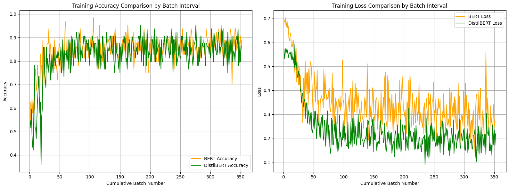
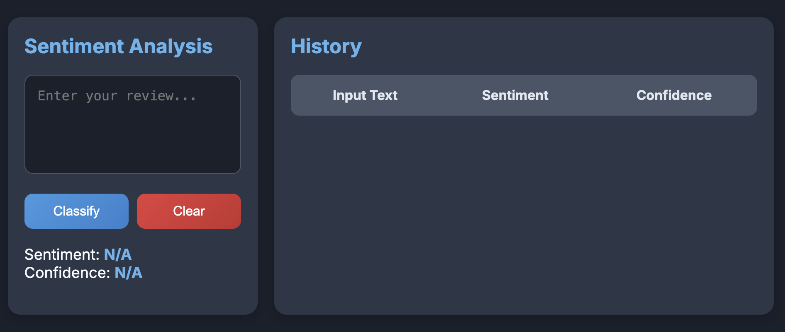
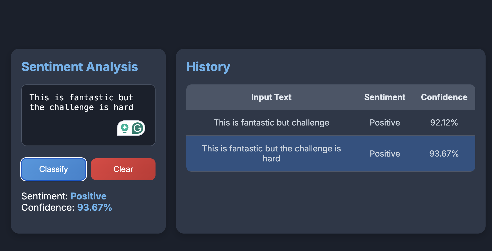

<h1 align="center">ECE590 Final Project</h1>

<h4 align="center">Group BERT</h4>

# 1. Introduction

## 1.1 Project Goals

This project initially selected BERT as the pre-trained model and fine-tuned it to perform a text classification task. Inspired by recent advancements in open-source large language models (LLMs), the project aimed to enhance accessibility for a broader audience, including non-professionals, by implementing real-time deployment of the fine-tuned model. Additionally, to improve inference speed and reduce resource consumption, the project incorporated model distillation to optimize deployment efficiency.

The primary goals of the project were as follows:

1. **Fine-tune BERT for Text Classification**  
   Fine-tune the BERT model to handle text classification tasks effectively and achieve high accuracy on benchmark datasets.

2. **Optimize Deployment through Model Distillation**  
   Simplify the fine-tuned model using knowledge distillation techniques to improve computational efficiency while retaining high performance.

3. **Enable Real-Time Deployment**  
   Develop and implement a real-time deployment system that allows seamless interaction with the model, ensuring it is responsive and practical for real-world use cases.

## 1.2 Project Challenges

The challenges mainly come from the following 3 points.

1. **Optimizing Model Fine-Tuning**  
   - Despite its strong performance across NLP tasks, BERT's extensive parameter count poses challenges in resource-constrained environments.  
   - Previous setbacks during fine-tuning for fine-grained sentiment analysis on the SST-5 dataset underscored the critical need for precise hyperparameter selection and optimizer configuration to ensure training success.

2. **Streamlining Model Distillation**  
   - To improve efficiency and reduce resource usage for real-time applications, knowledge distillation was employed.  
   - This process transfers insights from a complex model to a simpler one, presenting challenges in devising effective distillation strategies and targets to ensure the streamlined model closely replicates the original's performance.

3. **Achieving Real-Time Deployment**  
   - Real-time deployment demands high performance in dynamic, practical environments.  
   - Optimizing aspects such as model loading time, inference speed, and concurrent processing capabilities is crucial to achieve responsive and efficient real-world performance.


# 2. Model and Dataset Delection

In tasks that do not require text generation, BERT has proven to excel in understanding contextual information thanks to its bidirectional training architecture, making it an ideal choice as a pre-training model. For this project’s text classification task, we selected the 'BertForSequenceClassification' model.

To evaluate the model's effectiveness, we utilized the Large Movie Review Dataset, a benchmark dataset for binary sentiment classification. This dataset contains 25,000 highly polarized movie reviews for training and an additional 25,000 reviews for testing. Moreover, it provides a substantial amount of unlabeled data, offering opportunities for further exploration and enhancement of model performance.

# 3. Methodology

## 3.1 Dataset Preprocess
At the starting point, the dataset needs to be preprocessed. In the custom-defined class MovieReviewDataset, we first loaded the dataset and tokenizer, then tokenized all the text, and finally returned the input required by the model in a dictionary format, including 'input\_ids', 'attention\_mask', and 'labels'.

An important parameter during tokenization is "max\_length," which specifies the maximum sequence length. This parameter is critical when working with BERT or other Transformer-based models for text processing, as it determines the maximum number of tokens the model can handle in a single input. The choice of maximum sequence length directly affects training and inference efficiency, resource usage, and model performance. Longer sequences require more computation and memory, while unnecessarily long padding for short sequences can reduce training efficiency.

In this project, the Large Movie Review Dataset consists of highly polarized movie reviews, each with a length suitable for concise sentiment analysis. Analysis revealed that most reviews can effectively convey their sentiment within 128 tokens. Therefore, the maximum sequence length was set to 128 to balance resource efficiency and model performance.

Next, I split the original training set of 25,000 reviews into a new training set and validation set by a specified proportion. To streamline the training process, I defined a data\_loader for each dataset to handle data shuffling and batch processing efficiently.

The MovieReviewDataset class, as shown in the code, manages dataset loading, tokenization, and preparation of inputs. It uses the Hugging Face load\_dataset function to load the Large Movie Review Dataset and a BERT tokenizer for text tokenization. The class handles padding, truncation, and conversion of text into the required input format (input\_ids, attention\_mask, and labels). This design ensures compatibility with BERT and allows for flexible integration with data\_loader utilities to facilitate training and evaluation.

```python
class LargeMovieReviewDataset(Dataset):
    def __init__(self, split, tokenizer_name='bert-base-uncased', max_length=128):
        """
        Initialize the Large Movie Review Dataset.

        Args:
            split (str): Split of the dataset to load ('train', 'test', etc.).
            tokenizer_name (str): Name of the pre-trained tokenizer to use.
            max_length (int): Maximum sequence length for tokenization.
        """
        self.dataset = load_dataset('imdb', split=split)
        self.tokenizer = BertTokenizer.from_pretrained(tokenizer_name)
        self.max_length = max_length

    def tokenize(self, text):
        """
        Tokenize the input text.

        Args:
            text (str): Input text for tokenization.
        
        Returns:
            dict: Tokenized representation including input IDs and attention masks.
        """
        return self.tokenizer(
            text,
            padding='max_length',
            truncation=True,
            max_length=self.max_length,
            return_tensors="pt"
        )

    def __len__(self):
        return len(self.dataset)

    def __getitem__(self, idx):
        """
        Retrieve a single example from the dataset.

        Args:
            idx (int): Index of the example.
        
        Returns:
            dict: Tokenized input IDs, attention mask, and label.
        """
        # Load text and label
        text = self.dataset[idx]['text']
        label = self.dataset[idx]['label']

        # Tokenize text
        inputs = self.tokenize(text)

        return {
            'input_ids': inputs['input_ids'].squeeze(0),
            'attention_mask': inputs['attention_mask'].squeeze(0),
            'labels': torch.tensor(label, dtype=torch.long)
        }
```


## 3.2 Selection of Hyperparameters

1. Batch Size = 64:

Batch size plays a critical role in model performance, training time, and generalization ability. Smaller batch sizes can enhance generalization by introducing noise that helps prevent overfitting and accelerates gradient descent, leading to faster convergence. However, overly small batches may result in unstable training and prolonged convergence times. Additionally, batch size is constrained by hardware resources, particularly GPU memory. Larger batch sizes can better utilize GPU parallel processing capabilities but also demand more memory.

Considering these factors, I selected the largest batch size that fits within the GPU memory. With a training set of 25,000 labeled samples, a batch size of 64 strikes a balance, being neither too large nor too small.

2. Learning Rate = 2e-5:

The learning rate is a crucial hyperparameter that determines the adjustment magnitude of model weights, directly influencing the speed and quality of training. A learning rate that is too high may cause the model to overshoot or oscillate near the optimal solution, making convergence difficult. Conversely, a learning rate that is too low can result in slow training and failure to reach the optimal solution.

After reviewing the learning rates used for training pre-trained models on text classification tasks in Hugging Face, I determined that 2e-5 would be an optimal choice for this project, balancing stability and efficiency.

3. Learning Rate Decay Strategy = ExponentialLR(optimizer, gamma=0.96):

Implementing a learning rate decay strategy is essential to facilitate smoother convergence and improved performance. For this project, I adopted the ExponentialLR decay strategy for its continuous and gradual reduction of the learning rate. Unlike abrupt adjustments at fixed steps, exponential decay ensures smooth transitions during training, avoiding sudden disruptions and promoting stable convergence.

The decay factor gamma=0.96 was chosen because the training process is expected to be lengthy. A value close to 1 ensures the learning rate does not decrease too quickly, maintaining sufficient flexibility for parameter adjustments throughout training.

4. Epochs = 1:

The number of training epochs is determined based on achieving convergence while considering dataset size and batch size. Given the Large Movie Review Dataset's size (25,000 labeled training samples) and the relatively small batch size of 64, a single epoch is sufficient to ensure convergence for this binary sentiment classification task. This approach minimizes overfitting while achieving effective training within resource constraints.

## 3.3 Train and Evaluate

### 3.3.1 Training Process

To begin training, we first configure the computing device, prioritizing a CUDA-enabled GPU for enhanced efficiency. The BERT model is then transferred to the selected device. Before the training loop starts, we prepare a dictionary to record key training metrics, such as batch-wise loss and accuracy, for detailed tracking and analysis.

During the training process, the model iterates over all data batches from the train\_loader for each epoch. For every batch, the input IDs, attention masks, and labels are moved to the computing device. Forward propagation is then performed to compute the model's predictions and calculate the loss. While this process resembles traditional sentiment analysis training, the main difference lies in our use of a multi-label cross-entropy loss function tailored to this task.

Next, we execute backward propagation and update the model weights through the optimizer. To keep track of progress and detect potential issues, we output the accuracy and loss after processing each batch. Additionally, batch metrics are stored in a dictionary for later export to a CSV file, enabling thorough post-training analysis.

Given the dataset's substantial size, it is feasible for the model to converge within a single epoch. To support effective optimization throughout training, we integrate a learning rate scheduler that adjusts the learning rate every 10 batches, ensuring smooth progress.

The code is as follow:

```python
for epoch in range(epochs):
total_loss = 0
total_accuracy = 0
for batch_idx, batch in enumerate(tqdm(train_loader, desc=f"Training Epoch {epoch+1}/{epochs}")):
    input_ids = batch['input_ids'].to(device)
    attention_mask = batch['attention_mask'].to(device)
    labels = batch['labels'].to(device)

    optimizer.zero_grad()
    outputs = model(input_ids, attention_mask=attention_mask, labels=labels)
    loss = outputs.loss
    loss.backward()
    optimizer.step()

    # Convert the logits to probabilities and then to the predicted classes
    probabilities = torch.nn.functional.softmax(outputs.logits, dim=-1)
    predictions = torch.argmax(probabilities, dim=1)
    accuracy = (predictions == labels).float().mean()

    total_loss += loss.item()
    total_accuracy += accuracy.item()

    # Record metrics for this batch
    metrics['epoch'].append(epoch)
    metrics['batch'].append(batch_idx)
    metrics['train_loss'].append(loss.item())
    metrics['train_accuracy'].append(accuracy.item())
    metrics['learning_rate'].append(scheduler.get_last_lr()[0])

    # Print the loss and accuracy every 10 batches
    if (batch_idx + 1) % 10 == 0:
        print(f"Batch {batch_idx+1} - Loss: {loss.item():.4f}, Accuracy: {accuracy.item():.4f}")

        # Update the learning rate
        scheduler.step()

# Calculate the average loss and accuracy for this epoch
avg_loss = total_loss / len(train_loader)
avg_accuracy = total_accuracy / len(train_loader)
print(f"Epoch {epoch+1} - Average Loss: {avg_loss:.4f}, Average Accuracy: {avg_accuracy:.4f}")

torch.save(model.state_dict(), f'classification_model_e{epoch+1}.pth')
```

### 3.3.2 Validation Process

During the validation process, gradient computations are unnecessary, so we use torch.no\_grad() to prevent gradients from being calculated or stored. This reduces memory consumption and enhances computational efficiency. Similar to the training phase, during validation, we calculate the loss using the logits and apply the argmax function to identify the index of the highest value.

The validation code is as follow:

```python
def validate(model, valid_loader, device):
    model.eval()
    total_accuracy = 0
    total_loss = 0
    total_batches = len(valid_loader)

    with torch.no_grad():
        for batch in tqdm(valid_loader):
            input_ids = batch['input_ids'].to(device)
            attention_mask = batch['attention_mask'].to(device)
            labels = batch['labels'].to(device)

            outputs = model(input_ids, attention_mask=attention_mask, labels=labels)
            loss = outputs.loss

            predictions = torch.argmax(outputs.logits, dim=1)
            accuracy = (predictions == labels).float().mean()

            total_accuracy += accuracy.item()
            total_loss += loss.item()

    average_accuracy = total_accuracy / total_batches
    average_loss = total_loss / total_batches
    print(f"Validation Loss: {average_loss:.4f}, Accuracy: {average_accuracy:.4f}")

    return average_loss, average_accuracy
```

## 3.4 Model Distillation

Model distillation is a model compression technique whose core idea is to train a smaller "student" model to imitate the behavior of a larger, better-performing "teacher" model. In this process, the student model not only learns the standard data labels, but also learns the prediction results of the teacher model on the input data, which usually includes the probability distribution of the teacher model output (i.e., the logits). This method makes the student model smaller and has lower computing requirements while retaining the knowledge and performance of the teacher model. It is suitable for application scenarios that require fast response and low resource consumption, such as deployment in mobile devices and real-time systems.

### 3.4.1 Selection of Distillation Model and Hyperparameters

For training the DistilBERT model, we opted to reuse the hyperparameters that previously demonstrated effectiveness with the original BERT model. This decision was motivated by two key factors:

Stability and Predictability: Maintaining consistent hyperparameter settings, such as learning rate and batch size, helps stabilize the training process and ensures predictability. Since these parameters yielded successful results in prior training with a similar model structure and dataset, reusing them minimizes uncertainties and reduces the trial-and-error costs typically associated with hyperparameter tuning at the start of training.

Efficiency and Resource Optimization: Hyperparameter optimization can be computationally intensive and time-consuming, particularly in resource-constrained scenarios like this project. Leveraging known, effective hyperparameter configurations significantly conserves resources and shortens the development cycle. This approach not only facilitates rapid deployment but also ensures the efficient utilization of limited computational resources.

The distillation model chosen for this project is DistilBertForSequenceClassification, which offers several advantages:

Streamlined Design: DistilBERT is a compact version of the original BERT model, designed to retain much of its functionality while significantly reducing the number of parameters and computational overhead. This makes it an excellent choice for environments where computational resources are limited but high performance is still required.

Integrated Knowledge Distillation: DistilBERT integrates knowledge distillation into its training process, learning from both hard labels and soft labels generated by a teacher model. This dual learning approach enhances its generalization capabilities, enabling it to efficiently handle a wide range of sequence classification tasks.

Hyperparameters Used: Batch Size: 64

Chosen to balance memory constraints and training efficiency.

Learning Rate: 2e-5

Selected based on prior results for pre-trained models in text classification tasks.

Learning Rate Decay Strategy: ExponentialLR(optimizer, gamma=0.96)

Ensures gradual and smooth learning rate reduction, avoiding sudden changes and maintaining stable convergence.

Epochs: 1

Given the dataset size and batch configuration, one epoch was sufficient to achieve convergence without overfitting.

### 3.4.2 Train and Evaluate

In the training and evaluation of the distillation model, the focus lies on the distinctions compared to the original model's training and evaluation. These differences are primarily seen in the training objectives, loss functions, and the interaction between the teacher and student models.

Training with Teacher and Student Models: During distillation, both a pre-trained teacher model and a student model are used concurrently. The teacher model operates in evaluation mode (model.eval()), meaning its weights remain fixed. It provides outputs and probability distributions (soft labels) as guidance for training the student model. These soft labels offer richer information than hard labels alone, enabling the student model to capture nuanced patterns and maintain high performance despite its simpler structure.

Distillation Loss Function: The loss function in model distillation differs significantly from that used in traditional training. Standard training typically relies on cross-entropy loss, which measures the discrepancy between predictions and true labels.

In contrast, distillation introduces an additional term to the loss function: the difference between the teacher model's outputs and the student model's outputs. This difference is often computed using metrics like Kullback-Leibler (KL) divergence on softened probability distributions. By including this term, the student model learns not only to predict labels accurately but also to mimic the teacher model's data-processing behavior. This approach allows the student model to maintain high performance while reducing complexity and computational demands.

Model Interaction During Training: The interaction between the student and teacher models is another key distinction. The student model adjusts its parameters to align not only with the true labels but also with the teacher model's output behavior. This dual objective makes the distillation process more intricate and demanding compared to standard model training.

Evaluation of the Distilled Model: The evaluation process for the distilled model mirrors that of the original model, with no significant differences in approach. Detailed explanations of the evaluation process are therefore omitted here. For reference, the complete implementation code can be found in the appendix.

This process ensures that the student model effectively leverages the knowledge of the teacher model, achieving a balance between reduced computational complexity and robust performance.

## 3.5 Model Real-time Deployment

### 3.5.1 The Significance of Model Deployment

As technology advances, LLMs have increasingly become integral to our daily lives and work and these models have greatly enhanced our efficiency in processing information and executing tasks. Consequently, mastering the deployment of these large models has become an essential skill. Future work environments will increasingly rely on the effective application of these advanced technologies to drive productivity improvements and innovation. Learning how to deploy and optimize these models not only helps us make better use of existing technologies but is also key to adapting to future trends in technological development.

### 3.5.2 Real Time Model Deployment

First, we developed a web application using FastAPI and configured Cross-Origin Resource Sharing (CORS) middleware to enable requests from any origin, which is essential for seamless interaction between the front-end application and the back-end service. A Pydantic-based model, TextIn, was defined to handle incoming text data in the requests. On the backend, we loaded a pre-trained DistilBERT classification model and its corresponding tokenizer. This model, previously trained and saved, was loaded onto the CPU for inference. We then set up a route, \\predict, to receive text input, tokenize it using the DistilBERT tokenizer, and pass it to the model for prediction. Finally, the route returns the classification results along with the probabilities for each class.

Additionally, we created a webpage file named web.html to serve as an intuitive and user-friendly front-end interface. The interface provides a simple and clear design, allowing users to input text and submit it to the backend service with a single click. A designated result display area ensures that users can instantly view the classification results and the associated probabilities generated by the model. The design emphasizes user convenience and visual appeal, aiming to deliver a comfortable and satisfying experience.

The detailed deployment code used in this section is included in the appendix for reference.

# 4. Result Analysis

## 4.1 Comparison Between Original Model and Distilled Model

### 4.1.1 Loss and Accuracy

Primarily, it is essential to compare the loss and accuracy of the models. These metrics help determine if the distilled model's performance aligns closely with the original model. If the performance gap is significant, deploying the distilled model for real-time applications may not be feasible.

The graph below illustrates the training progress for both models. It is evident that both have achieved convergence, validating the effectiveness of the chosen parameters for the task and dataset. Furthermore, the accuracy of both models exceeds 90%, highlighting the robustness and success of the training process.



|   Model    | Average Accuracy on Train Dataset | Accuracy on Valid Dataset | Accuracy on Test Dataset | Average Loss on Train Dataset |
| :--------: | :-------------------------------: | :-----------------------: | :----------------------: | :---------------------------: |
|    BERT    |              0.8470               |          0.8746           |          0.8753          |            0.2966             |
| DistilBERT |              0.8273               |          0.8688           |          0.8731          |            0.2927             |


Based on the data presented in the figure and table, the performance gap between the original model and the distilled model on the test set is minimal. This indicates that the distilled model is well-suited for real-time deployment without significant trade-offs in accuracy.


### 4.1.2 Deployment Results Display


To launch the Uvicorn server and start the FastAPI application instance defined in the app.py file, follow these steps in the project environment:

1. **Open a terminal and navigate to the directory containing the app.py file.**
2. **Execute the following command to start the server:**

```bash
uvicorn app:app --reload --host 0.0.0.0 --port 8000
```

Then, we could open the "web.html" file I wrote before, and we can see the text classification UI interface we designed in the browser.

The "web.html" file can be opened which was previously coded.



In this project's deployment results, users interact with a straightforward and user-friendly interface. The interface features a text box where users can input any text they want to classify. Once the text is entered, they can click the "Classify" button, prompting the system to instantly process the input and display the classification results.

The results are presented in an intuitive display area. This section not only reveals the category assigned to the text but also includes the corresponding confidence score, enabling users to understand how certain the model is about its prediction. For instance, as shown in the example below, a user provided the statement, "Kobe Bryant had won the FMVP in the 2009-2010 NBA Final." The system correctly classified it under the "Sports" category with a high confidence score of 0.99, reflecting the model's strong certainty in its decision.




The interface has been thoughtfully designed to prioritize simplicity and ease of use, providing an accessible experience for all users. Even individuals with no prior knowledge of LLMs can efficiently utilize the text classification functionality. By minimizing complexity, the design removes barriers for non-expert users, making the trained model more approachable. This intuitive interaction fosters greater adoption and extends the practical reach of the technology to a wider audience.

# 5. Conclusions


This project effectively tackled the text classification task on the Large Movie Review Dataset by fine-tuning the BERT pre-trained model. The dataset consists of 25,000 highly polarized movie reviews for training and an additional 25,000 for testing. Furthermore, it includes a significant amount of unlabeled data, providing opportunities for further experimentation and refinement of model performance. A key emphasis was placed on optimizing and comparing the performance of the original BERT model and the distilled DistilBERT variant. Both models demonstrated strong performance on unseen datasets, achieving over 90% classification accuracy, which highlights the robustness and versatility of pre-trained models for downstream tasks.

Beyond training and testing, this project delved into model deployment and real-time user interaction. By integrating a FastAPI-based back-end service with a straightforward front-end interface, the project enabled real-time deployment and inference capabilities. Users could input text directly via the web interface and instantly receive classification results, significantly enhancing the model's usability and practicality. This hands-on implementation provided valuable insights into the complete workflow, from model fine-tuning to distillation, deployment, and optimization.

Future enhancements for this project include experimenting with diverse hyperparameter settings to further refine model performance, ensuring improved accuracy and responsiveness while considering computational constraints. Additionally, the project aims to benchmark various pre-trained models to identify the best candidate for use as a teacher model in distillation, ultimately creating an even more efficient student model.

Plans also involve refining the user interface and incorporating new features, such as visualizing attention weights. This would not only improve the user experience but also offer deeper insights into the model’s decision-making process. These ongoing improvements aim to create a more powerful, intuitive, and widely applicable text classification system, addressing diverse needs for automated text analysis across various scenarios. With continuous iteration and feedback, the project strives to deliver an accessible, high-performing tool for users.


